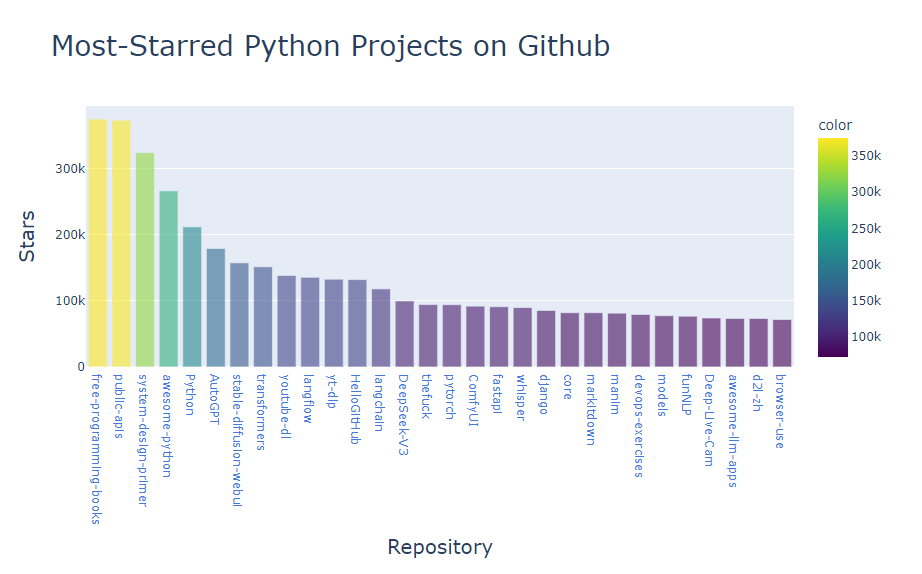

# 🐍 Python Crash Course — Chapter 16: Downloading Data

This project is based on **Chapter 16** of _Python Crash Course (3rd Edition)_ by Eric Matthes.  
The chapter focuses on **working with data**, **using APIs**, and **visualizing data** with libraries like **Plotly** and **Matplotlib**.


---

## 📘 Project Overview

The goal of this project is to:

- Learn how to **access web APIs** and **retrieve data** (e.g., GitHub repositories, weather data).
- **Parse JSON responses** using Python.
- **Visualize** the downloaded data with interactive charts using **Plotly**.
- Understand how to structure code for **data analysis projects**.

---

## 🧰 Technologies Used

- **Python 3.11+**
- **Plotly**
- **Requests**
- **Matplotlib** (optional)
- **JSON**

---

## ⚙️ Installation

1. Clone this repository:
   ```
   git clone https://github.com/batar-btr/python_api
   cd python_api
   ```
2. Create and activate virtual environment:
   ```
   python -m venv .venv
   source .venv/bin/activate    # macOS/Linux
   .venv\Scripts\activate       # Windows
   ```
3. Install dependencies:
   ```
   pip install -r requirements.txt
   ```
